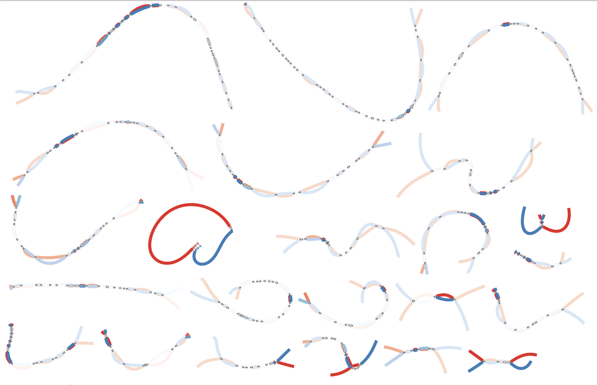

### Heterozygosity analysis


#### software preinstalled

- minimap2
- paftools
- Bandage


you can use different variant set as input to visualize the heterozygous blocks bewteen two haploytypes.


```shell
# MF2v0.8. maske cent
mat_fa=xxx/v0.8/MF2_mat.v0.8.fasta
pat_fa=xxx/v0.8/MF2_pat.v0.8.fasta

# split to chr
fastaKit -ap mat -o MF2_mat.v0.8.addTag.fasta $mat_fa
fastaKit -ap pat -o MF2_pat.v0.8.addTag.fasta $pat_fa
python3 bin/split_genome_bychrs.py MF2_mat.v0.8.addTag.fasta MF2_pat.v0.8.addTag.fasta

# autosome
for i in `seq 1 22`
do
 chr="chr"$i
 [ -d $chr ] || mkdir $chr
 cd $chr
 echo "#!/bin/bash
date
minimap2 -x asm5  -t 24 --cs mat_${chr}.fa pat_${chr}.fa |sort -k6,6 -k8,8n  > $chr.minimap.sort.paf
paftools.js call $chr.minimap.sort.paf > $chr.var.txt
date" >  $chr.minimap.sh
 #sbatch -c 24 --mem 16g $chr.minimap.sh
 grep -v '^R' $chr.var.txt |cut -f 2-4|sed 's/mat_//g' > $chr.var.bed
 sort -k1,1V -k2n $chr.var.bed |bedtools merge -i - > $chr.var.bed.merge
 cd ..
done

cut -f 1,2 xxx/v0.8/MF2_mat.v0.8.fasta.fai > mat.v0.8.genome.size
bedtools makewindows -g mat.v0.8.genome.size  -w 500000 -s 500000 > mat.genome.500k.bed

### all kinds of variants
cat chr*/*.var.txt |grep -v '^R' >autosome.allvar.txt
cat chr*/*.var.bed.merge > autosome.allvar.bed
bedtools coverage -a ../2.collect/mat.genome.500k.bed -b autosome.allvar.bed > autosome.500k.allvar.cov
python3 /bin/makeGFA_from_Bed.py autosome.500k.allvar.cov 0.0004 > autosome.500k.allvar.0.0004.ab.gfa

# then visualize autosome.500k.allvar.0.0004.ab.gfa using Bandage
```


### examples 

using all variants, calculate the coverage of variants (i.e. SV count by its length)




only using SV, calculate the count of SV (i.e. one SV count to 1)


